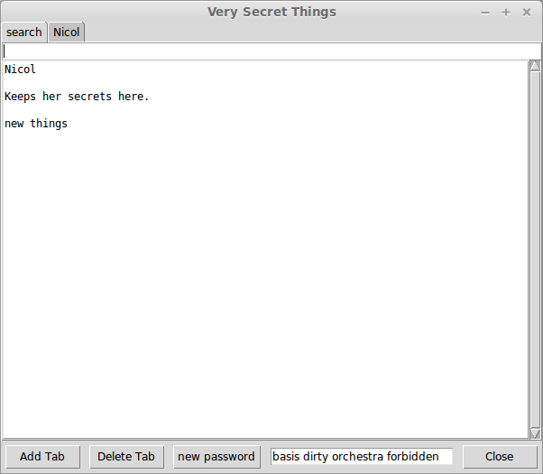

# SecretKeeper
A single-file python 2 program that stores your secrets.

A clean linux install will require the installation of TkInter and PyCrypto. 

A program that opens a GUI text entry, and saves the encrypted data to itself. The user can create tabs to sort the data, and each tab is basically a text entry. A random 4-word (xkcd style) password suggestion is presented. A search function searches all tabs. 

Windows takes issues with programs saving themselves, so this may not work (but I've never tried).

To change the password (key), you must import from python, since I'm too lazy to make a GUI password changer at the moment:

    import SecretKeeper
    SecretKeeper.rekey('old_key', 'new_key')

To run, you can provide the password as an argument:

    ./SecretKeeper.py nicol

or, if you don't, a dialog will prompt you for the password.

After making changes, the Close button becomes a Save&Close button. If you don't want to save your changes, close with the OS (little x on the title bar, usually, or middle click on the Gnome panel).

